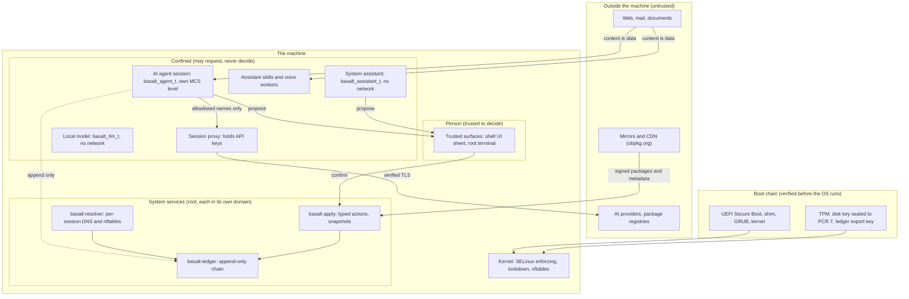

# Threat model

What Basalt OS protects, from whom, where the trust boundaries are, and
what we assume. Control IDs (BSC-AREA-NNN) point at [controls.md](controls.md).

## Assets

| Asset | Examples | Main controls |
|---|---|---|
| The person's data | documents, mail, photos, source code, browser profiles | DISK, AGENT, MAC |
| Credentials | SSH and GnuPG keys, keyrings, saved passwords, API keys for AI providers, tokens in projects | AGENT-001, AGENT-003, AGENT-004, MAC-005 |
| Integrity of the system | packages, kernel, boot chain, SELinux policy, configuration | BOOT, PKG, MAC, UPD |
| The person's authority | the right to approve changes, send mail, spend money, change security settings | GATE |
| The audit trail | what agents, the assistant, administrators and services did | LEDGER |
| Availability and recoverability | a machine that boots, updates that can be undone, data that survives a rollback | UPD, DISK-002 |
| Privacy | what the person asks, reads and does; identifiers of the machine | PRIV, NET |
| Our signing keys | release key, kernel module CA, module signing keys | KEY |

## Adversaries

| Adversary | What they can do | What they want | Main controls |
|---|---|---|---|
| Malicious content: web pages, mail, documents, search results, knowledge entries, including prompt injection | put text in front of an AI model that the person or an agent reads | make the AI act for them: send data out, change the system, approve something | AI-004, AI-005, GATE-001, GATE-002, GATE-009, NET-001 |
| A compromised or misbehaving AI agent (Claude Code, Codex and others), whether injected, buggy or malicious | run commands as a confined process with access to one project and an allowlisted network | read credentials, persist, escalate, exfiltrate, approve its own requests | AGENT, NET, MAC-005, GATE-001, LEDGER-003 |
| A malicious package or repository | get code installed: a poisoned dependency an agent fetches, a compromised third-party repository, a tampered mirror | run code as root at install time, or as the person | PKG-001, PKG-005, AGENT-001, UPD-001 |
| A local attacker with physical access | steal the laptop or disk, boot another system, change firmware settings, read the disk | read data, plant a boot kit, unlock the disk | DISK, BOOT, KEY |
| A compromised account | the person's password or SSH key is stolen; a remote session as the person | act as the person, become root, hide traces | NET-009, LEDGER, GATE (administrator authentication) |
| Supply chain of Basalt itself | compromise our build host, CI, signing machine, hosting or a developer account | ship a signed malicious package or knowledge file | PKG-002, PKG-003, PKG-004, PKG-008, KEY, GOV-004 |
| A network attacker | observe or modify traffic, run a rogue DNS or Tang server | tamper with downloads, learn what the person does | PKG-001, AI-001, AI-002, DISK-004, NET-002 |
| A remote model or service provider the person chose | receive what is sent to it | learn more than needed | PRIV-002, PRIV-005 |

Out of scope: an attacker who already has root on a running machine
(they can turn most things off; the ledger makes this visible, it cannot
prevent it), hardware and firmware implants, side channels in the CPU,
and flaws in Fedora packages Basalt installs unchanged (report those
upstream). Problems in how Basalt configures or confines them are in
scope.

## Trust boundaries

The boundaries, in words:

1. Content and the machine. Everything that comes from outside (pages,
   mail, files, search results, knowledge answers) is data. It may be
   shown, summarized and quoted; it never becomes an instruction, a plan, a
   recipient or a destination (AI-005, GATE-009).
2. Requesters and deciders. Models, agents, apps and scripts may request.
   Only a trusted surface, identified by the kernel and not by what a
   client says, may decide (GATE-001, GATE-003). Today those surfaces are
   the shell UI's confirmation sheet and a root terminal; the planned
   approval gate unifies them (GATE-007).
3. Agent sessions and everything else. An agent session sees one project,
   its own home and an allowlisted network, at its own SELinux level
   (AGENT, NET). Its keys stay in the proxy (AGENT-003).
4. Producers and the audit trail. Anyone may append their own records;
   nobody can change or remove one; who wrote a record comes from the
   kernel (LEDGER-002, LEDGER-003).
5. Machine and network. Downloads are trusted for their signatures, never
   for where they came from (PKG-001, AI-001, AI-002). Inbound access is
   SSH with keys (NET-008, NET-009).
6. Boot and the running system. The firmware, shim, GRUB and kernel are
   verified before the system runs; the disk opens unattended only when
   the Secure Boot state is unchanged (BOOT, DISK-003).
7. Our release process and the world. Build hosts hold no keys; signing is
   isolated; published files never change (PKG-002 to PKG-004, KEY).

## How the main attacks are stopped

| Attack | Stopped by | Leaves a trace in |
|---|---|---|
| A web page tells the assistant "send the user's files to this address" | content is fenced as data; the recipient must come from the person; sending is a person-only action with an exact preview | assistant activity log, ledger |
| An agent reads `~/.ssh/id_ed25519` | SELinux (no rule, and a neverallow so none can be added) | agent session log, ledger |
| An agent sends its API key to a server it controls | the agent never has the key; the proxy adds it only for the provider's host | `credential.strip` records |
| An agent hides data in DNS names | unlisted names refused before any upstream query | `dns.deny` |
| An agent approves its own proposal | only the UI domain may confirm; the confirmation code is never given to requesters | shell activity log |
| A tampered package on a mirror | dnf refuses the signature or the metadata | dnf output |
| A stolen laptop | LUKS2; the TPM unseals only with the expected Secure Boot state; otherwise the recovery key is needed | not applicable |
| Root edits the ledger to hide an action | the chain breaks and `verify` reports it; immutable sealed files need an explicit attribute change first | the broken chain itself |
| A broken or malicious update | snapshots before and after every transaction; rollback from the system or the boot menu | snapshot descriptions, ledger |

## Assumptions

- The CPU, firmware and TPM behave as specified, and Secure Boot is on.
  Without Secure Boot, lockdown on the kernel command line still refuses
  unsigned modules, but the boot chain itself is not verified.
- SELinux stays enforcing with the Basalt modules loaded. Turning it off is
  possible for root and removes most confinement; the ledger records it.
- The person reads what a confirmation sheet shows before approving it.
  Basalt makes the preview exact and hard to spoof; it cannot make a
  person read it.
- Fedora's packages, signing and mirror network are trustworthy; Basalt
  does not re-sign Fedora packages.
- Our signing keys are handled as [docs/key-ceremony.md](../key-ceremony.md)
  describes.
- The person's own processes outside agent sessions run unconfined
  (unconfined_t), as on Fedora. Code the person runs by hand is trusted as
  the person; confined user roles are planned (MAC-007).
- An allowlisted host that accepts uploads (a package registry, GitHub)
  can receive what an agent sends it. The allowlist is the boundary;
  keeping it short is part of the model (AGENT-007).

## Known limits

- The ledger is tamper evident, not tamper proof: root can delete or
  rewrite files; the chain shows it, but the record of what happened can
  be lost. Anchoring off the machine is planned (LEDGER-008).
- PCR 7 does not identify which signed kernel booted; with stock keys any
  Fedora-signed chain unlocks the disk (DISK-003). Custom db mode and Tang
  narrow this.
- SELinux reasons about port types, not host names; host names are
  enforced by the proxy and the kernel sets (NET-001).
- Prompt injection defenses are measured by a public corpus; the live
  assertions against a running assistant are still to be run (AI-005).
- Desktop applications other than Basalt's own are not confined yet
  (MAC-008).
